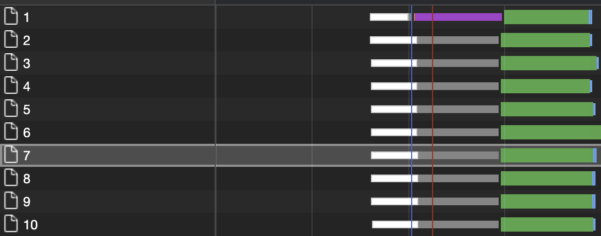
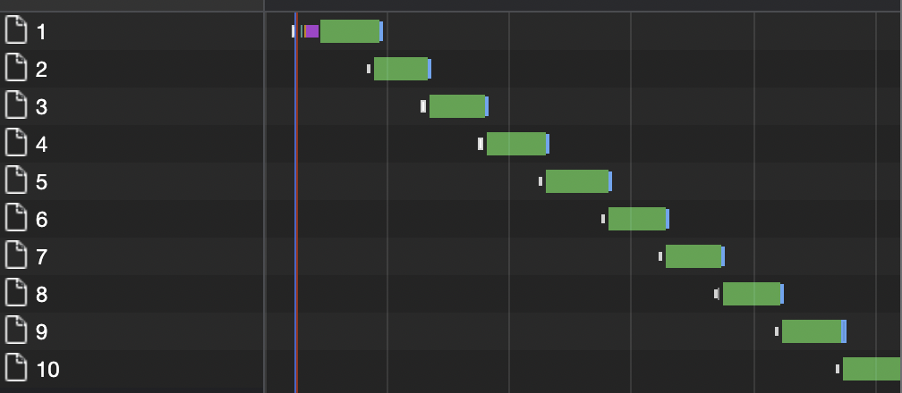
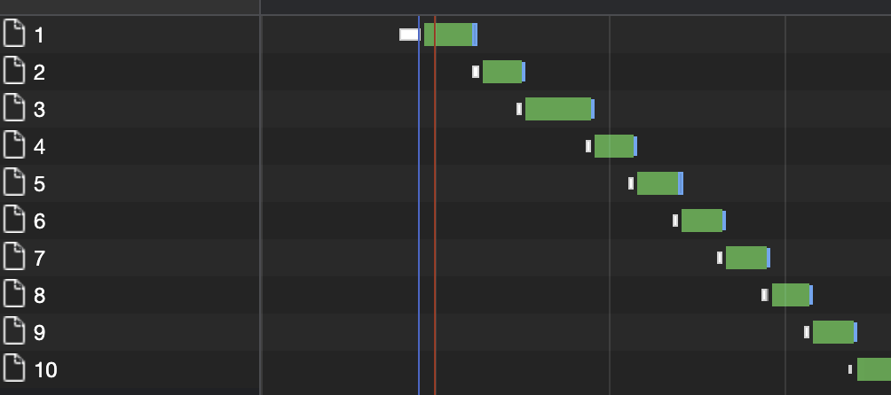
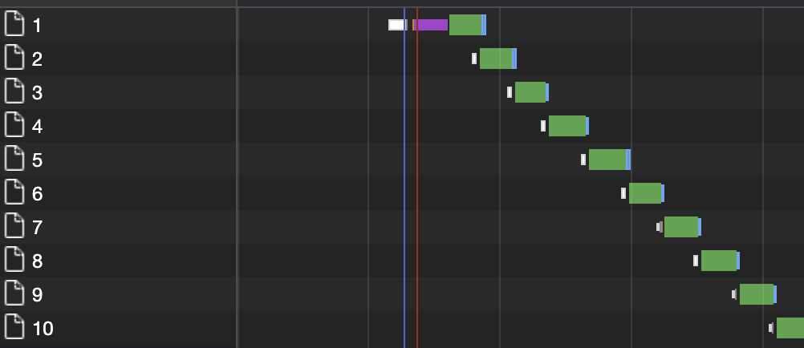

# 迴圈中的 async/await

## 結論

-   forEach、map、reduce 之類有一個`callbackFn`的都`不會等待`
-   其他 loop 都`會等待`

更追根究底一點應該要去研究，map、reduce 之類的 function，javascript engine 是怎麼實現的，
不過實務上還是用 Promise.all()、Promise.allSettled()之類的去處理比較好

## 驗證

### forEach

```js
const ids = [1, 2, 3, 4, 5, 6, 7, 8, 9, 10]
ids.forEach(async (id) => {
    await fetch(`https://jsonplaceholder.typicode.com/posts/${id}`)
})
```

forEach 的 network waterfall 圖


-   而且因為每次請求所花的時間會稍微不一樣，所以完成的順序也可能不固定

### map

```js
const ids = [1, 2, 3, 4, 5, 6, 7, 8, 9, 10]
ids.map(async (id) => {
    const res = await fetch(`https://jsonplaceholder.typicode.com/posts/${id}`)
})
```

map 的 network waterfall 圖


-   行為跟 forEach 一樣

### reduce

```js
const ids = [1, 2, 3, 4, 5, 6, 7, 8, 9, 10]
ids.reduce(async (acc, id) => {
    const res = await fetch(`https://jsonplaceholder.typicode.com/posts/${id}`)
}, [])
```

reduce 的 network waterfall 圖


-   行為跟 forEach 一樣

### for ... of

```js
const ids = [1, 2, 3, 4, 5, 6, 7, 8, 9, 10]
const fetchData = async () => {
    for (const id of ids) {
        await fetch(`https://jsonplaceholder.typicode.com/posts/${id}`)
    }
}
fetchData()
```

for of 的 network waterfall 圖


-   他會等前面一個執行完，才會執行下一個

### for loop

```js
const ids = [1, 2, 3, 4, 5, 6, 7, 8, 9, 10]
const fetchData = async () => {
    for (let i = 0; i < ids.length; i++) {
        await fetch(`https://jsonplaceholder.typicode.com/posts/${ids[i]}`)
    }
}
fetchData()
```

for loop 的 network waterfall 圖


-   跟 for in 一樣，他會等前面一個執行完，才會執行下一個

### while loop

```js
const ids = [1, 2, 3, 4, 5, 6, 7, 8, 9, 10]
const fetchData = async () => {
    let x = 0
    while (x < ids.length) {
        await fetch(`https://jsonplaceholder.typicode.com/posts/${ids[x]}`)
        x++
    }
}
fetchData()
```

while loop 的 network waterfall 圖


<Comment />
