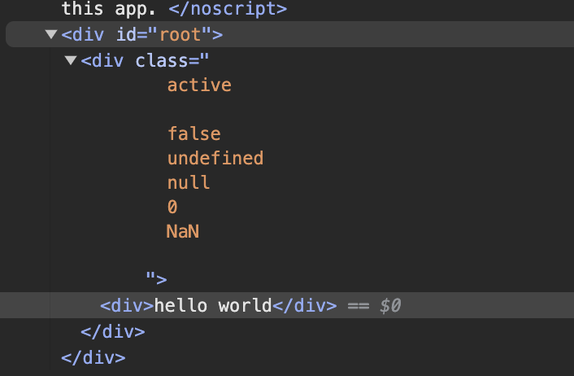
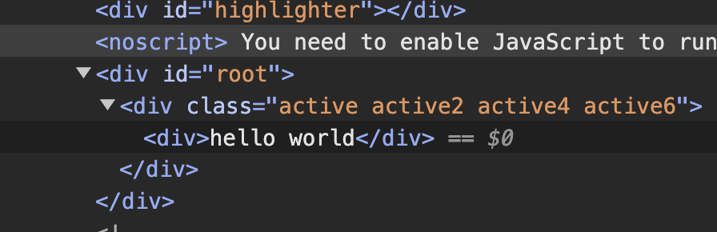

# React 動態 className 的最佳實踐

## 前言

`React`根據`條件判斷`所產生的`動態className`也是另外一個可能會讓代碼變`混亂`的來源。

找些資料，試著寫個 `best practice`，以後有新的發現也會持續更新。

## falsy value

在不套用 React 生態一堆稀奇古怪的 css solution 情形下，我們把`falsy` value 帶到 className 裡面，看一下 react 會怎麼處理

```jsx
export default function App() {
    return (
        <div
            className={`
                active
                ${'' && 'active1'}
                ${false && 'active2'}
                ${undefined && 'active3'}
                ${null && 'active4'}
                ${0 && 'active5'}
                ${NaN && 'active6'}
                ${false ? 'active7' : ''}
            `}>
            <div>hello world</div>
        </div>
    )ˋ
}
```

結果顯示



-   使用邏輯操作符`&&`，除了`空字串`，其他 false value 都被打印出來了，這肯定不是我們要的
-   使用`三元操作符`，讓判斷式為`false`時，回傳`空字串`，就能符合我們的預期。
    -   在沒有任何額外加工的情況下，上面三元操作符的寫法，`可讀性`還可以，但是代碼有點落落長。

## package 解法

列了三個解法：

-   [classnames](https://github.com/JedWatson/classnames) (729 bytes)
-   [clsx](https://github.com/lukeed/clsx) (516 bytes)
-   [merge-class-names](https://github.com/wojtekmaj/merge-class-names) (372 bytes)

`merge-class-names`檔案最小，但是他沒有我想要的寫法

`clxs`跟`classnames`支援的各種寫法幾乎一樣，但是 clsx 檔案比較小，專案比較新，雖然星星數差了 3 倍，不過 clsx 有 6000 多顆星星，也不少就是了

## 土炮解法

我最理想的寫法是可以寫固定的字串，跟動態的用 object 去判斷

示意如下：

```jsx
classNames('foo', { bar: true }) // => 'foo bar'
```

寫了一個 utillity 叫 classNames 的 function 去達到我要的要求。

```jsx
export default function App() {
    return (
        <div
            className={classNames('active', { active2: true, active3: NaN }, 'active4', {
                active5: undefined,
                active6: true
            })}>
            <div>hello world</div>
        </div>
    )
}

function classNames() {
    return Object.keys(arguments)
        .map((key) => {
            const item = arguments[key]
            if (typeof item === 'object') {
                return Object.keys(item).filter((k) => item[k])
            }

            return item
        })
        .flat()
        .join(' ')
}
```

結果


我們來看一下 classNames 是怎麼實現的

-   輸入的參數只有兩種型別，`string`跟 `object`。
-   透過`arguments`變量(iterable object)，用`Object.keys`對其作遍歷，因為有 key，回圈時就能對應到該個 value
-   value 是`string`時，不額外作為
-   value 是`object`時(相當於代碼中的 item)，一樣對該 item 做遍歷
-   用`filter`過濾，留下值是 true 的
-   出來的結果會是一個類似這樣的東西，`['tag1', ['tag2','tag3'],tag4,['tag5','tag5']]`
-   然後再用 `flat()`，去把 nesting array 攤平
-   在用 `join()`，`空格`做連接，把 array 組合成一個字串，就是我們需要的啦

## 套用 css module

套用一下常見的 `css module`，看一下代碼會變成怎樣

```jsx
import { active, active2, active3, active4, active5, active6 } from './App.module.css'
export default function App() {
    return (
        <div
            className={classNames(active, { [active2]: true, [active3]: NaN }, active4, {
                [active5]: undefined,
                [active6]: true
            })}>
            <div>hello world</div>
        </div>
    )
}
```

因為原本是 `string` 的部分，都被取代成 `variable` 了。

在 object 中，`key` 用 variable 表示的話，要多個`[]`，就變成`[active2]: true`

<Comment />
