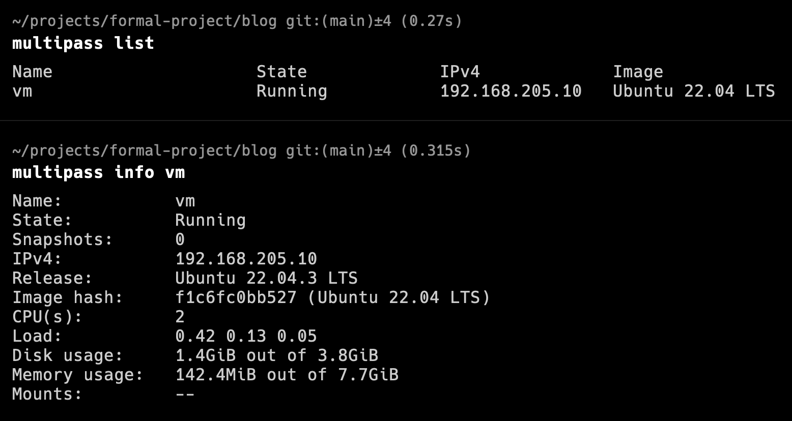

# 用 Mutipass 跑個類似公有雲的 VM

## 前言

在本地要跑個 VM，通常都是用`VirtualBox`或是`VMware`，假如是用 Mac arm 架構，`M1/M2` 系列的，那會有一些問題

M1 使用 VirtualBox，除了效能差之外，還常常 crash，而且官方似乎不打算修復([參考連結](https://kskroyal.com/virtualbox-drops-support-for-apple-silicon-mac/))

VMware 新版的`Fusion`，需要 199 美

Mac M1 有個`parallel Desktop`，可裝虛擬機，很好用，尤其拿來玩 windows 遊戲，但是一年也要 4000 多台幣

那要免費的，又能在 M1/M2 上正常運作的，`Multipass`絕對是最佳選擇

## 什麼是 Multipass

-   Multipass 是一個輕量級的 `VM` 管理工具
-   使用業界標準`cloud-init`，如同其他著名`公有雲`一樣，用一樣的方式去啟動`instance`
-   可以在 `Linux`、`Mac`、`Windows`上面運行

### cloud-init

根據`cloud-init`的[官網](https://cloud-init.io/)跟[github](https://github.com/canonical/cloud-init)描述

`cloud-init`是`業界標準`，各大`雲平台`拿來創 `VM` 的 `image 模板`

創建的時候也可以帶入自定義的 `metadata`(類似設定)

支援主流的 `Ubuntu`、`archLinux`、`CentOS`、`FreeBSD`、`Fedora`、`OpenSuse`、`Gentoo Linux` 等等

## 如何使用 Multipass

### 安裝

在官網的[安裝頁面](https://multipass.run/install)，選擇自己對應的系統安裝

我是用 Mac，使用 `brew` 去安裝，很簡單

安裝完輸入`multipass version`來檢查有沒有安裝成功

```bash
brew update
brew install multipass

multipass version
# multipass   1.13.0+mac
# multipassd  1.13.0+mac
```

### 啟動一個 VM

打下面指令，會啟動一個叫`vm`的 instance

設定`名稱`、`cpus`、`記憶體`跟`硬碟`大小

假如沒設定，名稱會變成`隨機`，規格會用跑該 VM `最小的規格`

```bash
multipass launch --name vm --cpus 2 --memory 8G --disk 4G
```

輸入`multipass list`，列出所有 instance

輸入`multipass info vm`，可以看名叫 vm 的詳細資訊



輸入`multipass shell vm`，可以進到名叫`vm`的 instance 裡面操作

輸入`exit`就可以離開


### 常用指令

輸入`multipass help`，會列出所有指令，對常用的做一些說明

```bash
multipass launch # 新建一個instance
multipass find   # 列出可用的image
multipass launch <imageType>
# 用選定的image種類去起instance
# 有docker可以起portainer
# 有minikube可以起k8s

multipass list         # 列出instance
multipass info <name>  # 查某個instance詳細資訊
multipass shell <name> # 進到某個instance的command line

multipass suspend <name> # 待機某個instance
multipass stop <name>    # 停止某個instance
multipass start <name>   # 啟動某個已待機/停止的instance
multipass delete <name>  # 刪除某個instance, 只會標注刪除
multipass purge          # 把所有標注刪除的instance真的刪除
```

蠻意外的，他居然有 `portainer` 跟 `minikube`

### multipass shell

`multipass shell vm`其實相當於以下的指令

key 放在`/var/root/Library/Application\ Support/multipassd/ssh-keys/id_rsa`裡面

```bash
sudo ssh  -i /var/root/Library/Application\ Support/multipassd/ssh-keys/id_rsa ubuntu@192.168.205.9
```

<Comment />
