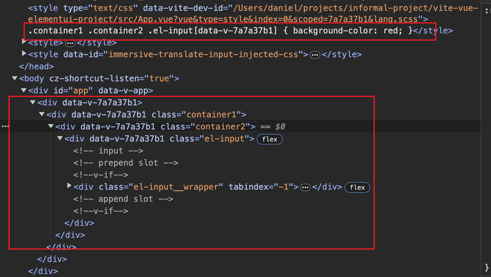
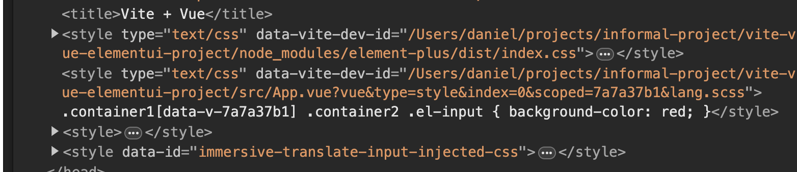
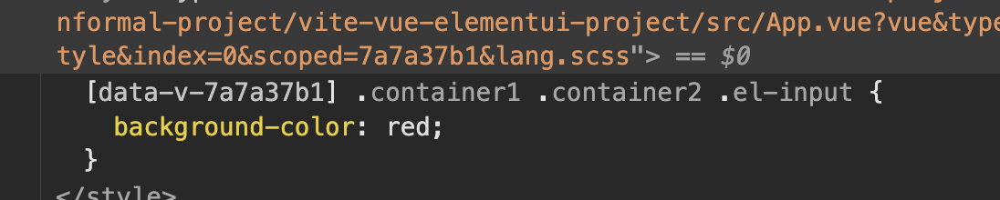

# Vue 的 Scoped CSS

## 前言

網路上講 Vue Scoped CSS 文章實在是很多，大都是講`穿透`兩個字就帶過去

其實觀察 `vue-loader` 加 `webpack` compile 出來的檔案規則，蠻好懂的

很容易就舉一反三

## 原理

在`SFC`裡面，`vue-loader` 會從該 component`最外層的 div` 開始

每一個`元素`都加上類似這樣的屬性`data-v-7a7a37b1`

然後在 css 樣式加上`[data-v-7a7a37b1]`，把樣式`鎖`在那個`component`裡面

`7a7a37b1`根據[vue-loader 源碼](https://github.dev/vuejs/vue-loader)，是透過以下的 function 產生的

跟`檔案路徑`還有`檔案名稱`有關，並`不是`真的`隨機`

```js
import * as crypto from 'crypto'

// module id for scoped CSS & hot-reload
const rawShortFilePath = path.relative(rootContext || process.cwd(), filename).replace(/^(\.\.[\/\\])+/, '')
const shortFilePath = rawShortFilePath.replace(/\\/g, '/')
const id = hash(isProduction ? shortFilePath + '\n' + source.replace(/\r\n/g, '\n') : shortFilePath)

function hash(text: string): string {
    return crypto.createHash('sha256').update(text).digest('hex').substring(0, 8)
}
```

編譯後的的 CSS 跟 html，看下面的代碼會比較好懂

## 代碼

例如以下的代碼

```js
<template>
    <div>
      <div class="container1">
        <div class="container2">
          <el-input />
        </div>
      </div>
    </div>
</template>

<style scoped lang="scss">
.container1 {
  .container2 {
    .el-input {
      background-color: red;
    }
  }
}
</style>
```

經過 webpack 會 compile 成如下圖



`屬性selector`會被掛在`最裡面`的`class`，也就是`.el-input`那邊

下面的`el-input__wrapper`是後來 element-ui 用 JS 去產生的

並`不會`被 vue-loader 加上`data-v-7a7a37b1`，這一點很重要

因為通常都是想改`套件`用 JS 產出來的元件的樣式

### :deep()

在 css 的選擇器用`:deep()`包起來，就可以控制`[data-v-7a7a37b1]`這個屬性選擇器顯示在哪裡

我們把`.container2`用`:deep()`包起來

這告訴`vue-loader`，屬性選擇器要掛在`.container2`的上一層，也就是`.container1`

```js
.container1 {
  :deep(.container2) {
    .el-input {
      background-color: red;
    }
  }
}
```

編譯出來的結果如下



那假如把`:deep()`掛在`.container1`會變成怎樣

就再往外一層，如下圖



了解 scoped css 產生的 attribute 掛的位置機制，問題就很容易分析理解了

<Comment />
