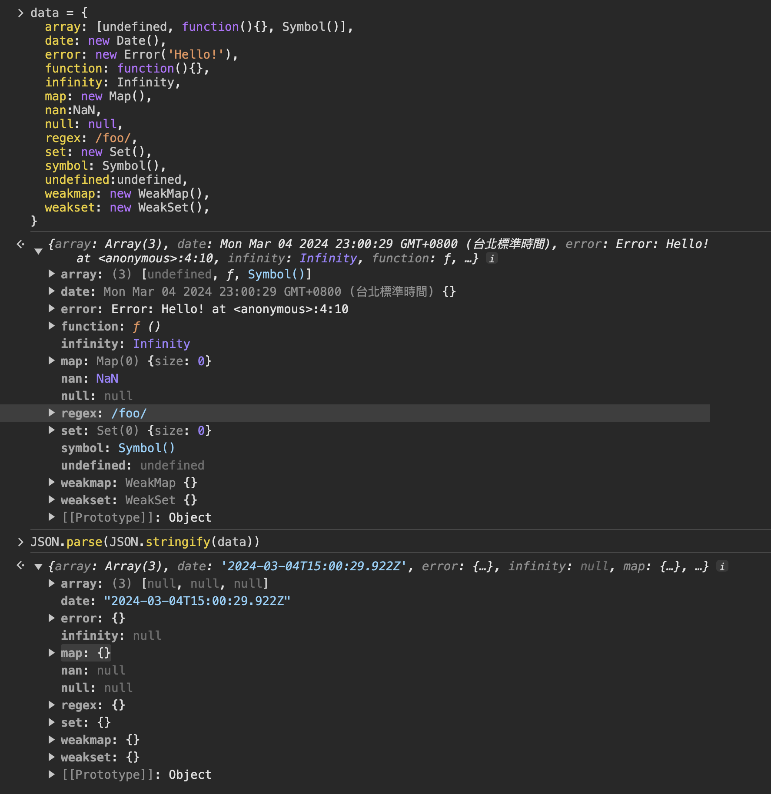
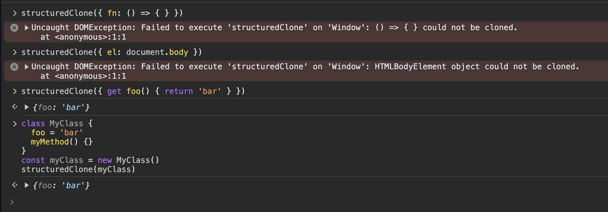

# 淺拷貝與深拷貝詳解

## 淺拷貝(shallow clone)

淺拷貝是

-   對 Object 只有`一層深度`的 複製
-   假如對應的值是`reference`，原本的跟複製的會共用，會互相影響

常見的做法有

### Spread Syntax

```js
const original = { name: 'Alice', age: 30 }
const shallowCopy = { ...original }

// Modifying the copy doesn't change the original
shallowCopy.name = 'Bob'
console.log(original) // { name: "Alice", age: 30 }
console.log(shallowCopy) // { name: "Bob", age: 30 }
```

### Object.assign

```js
const original = { name: 'Alice', age: 30, address: { city: 'New York' } }
const shallowCopy = Object.assign({}, original)

// 有共用reference的值，修改後，原本的跟複製的會互相影響
shallowCopy.address.city = 'San Francisco'
console.log(original) // { name: "Alice", age: 30, address: { city: "San Francisco" } }
console.log(shallowCopy) // { name: "Alice", age: 30, address: { city: "San Francisco" } }
```

## 深拷貝(deep clone)

一般深拷貝有三種解法

-   JSON.parse(JSON.stringify(obj))
-   structuredClone(obj)
-   \_.cloneDeep(obj) (第三方套件)

### JSON.parse(JSON.stringify(obj))

這個其實就是先對 javascript `序列化(serialize)`，然後再用 `JSON`反序列化(deserialize)

`JSON.stringify()` 會把 `value` 轉成`JSON notation`

轉換行為可以參考[MDN](https://developer.mozilla.org/en-US/docs/Web/JavaScript/Reference/Global_Objects/JSON/stringify)

value 有改變的，以下做個統整

-   `undefined`、`function`、`跟symbol`
    -   會被忽略，變成`空的`
    -   但是在`array`中會變成`null`
-   `Infinity`、`NaN`、`null`
    -   都被轉成 `null`
-   `Map`、`Set`、`WeakMap`、`WeakSet`、`Error`、`regex`
    -   都被轉成 `{}`
-   `new Date`
    -   轉成`string`
    -   有`.toJSON()`方法的，`JSON.stringify()`會執行`.toJSON()`
-   `TypedArray`類型
    -   Int8Array、Int16Array、Int32Array、Uint8Array、Uint16Array、Uint32Array 等等
    -   JSON.stringify(new Int8Array([1])) 都會變成`'{"0":1}'`



還蠻多雷的其實

尤其是常見的`function`跟`undefined`，直接消失

不熟的 debug，de 半天

### structuredClone(obj)

structuredClone 前身是`Structured cloning`演算法

詳情看這篇[文章](https://surma.dev/things/deep-copy/index.html)

瀏覽器有三種 api 可以使用這個演算法

只是很不方便

-   `MessageChannel`
-   `History API`
-   `Notification API`

還好現在實現了原生的`structuredClone`

比較值得注意不支援的有四種

-   `function`
-   `dom node`
-   `getter/setter`
-   `object prototype`

詳細可以看[MDN](https://developer.mozilla.org/en-US/docs/Web/API/Web_Workers_API/Structured_clone_algorithm#supported_types)



`getter/setter` 在 在 `vue` 的情境下還蠻常碰到的

`function` 一樣是沒支援

[Structured cloning 演算法](https://html.spec.whatwg.org/multipage/structured-data.html#structuredserializeinternal)可以在 html spec 中找到

### \_.cloneDeep(obj)

以下是 lodash 的 cloneDeep 的代碼

基本上就是在 runtime 時

逐個判斷型別，做相對應的複製

然後再 recursive 下去

有時間再回來補這邊源碼的講解

或是另開一篇，哈哈

```js
// src/deepClone.ts

const CLONE_DEEP_FLAG = 1
const CLONE_SYMBOLS_FLAG = 4

function cloneDeep(value) {
    return baseClone(value, CLONE_DEEP_FLAG | CLONE_SYMBOLS_FLAG)
}
```

```js
// src/.internal/baseClone.ts

function baseClone(value, bitmask, customizer, key, object, stack) {
    let result
    const isDeep = bitmask & CLONE_DEEP_FLAG
    const isFlat = bitmask & CLONE_FLAT_FLAG
    const isFull = bitmask & CLONE_SYMBOLS_FLAG

    if (customizer) {
        result = object ? customizer(value, key, object, stack) : customizer(value)
    }
    if (result !== undefined) {
        return result
    }
    if (!isObject(value)) {
        return value
    }
    const isArr = Array.isArray(value)
    const tag = getTag(value)
    if (isArr) {
        result = initCloneArray(value)
        if (!isDeep) {
            return copyArray(value, result)
        }
    } else {
        const isFunc = typeof value === 'function'

        if (isBuffer(value)) {
            return cloneBuffer(value, isDeep)
        }
        if (tag === objectTag || tag === argsTag || (isFunc && !object)) {
            result = isFlat || isFunc ? {} : initCloneObject(value)
            if (!isDeep) {
                return isFlat
                    ? copySymbolsIn(value, copyObject(value, keysIn(value), result))
                    : copySymbols(value, Object.assign(result, value))
            }
        } else {
            if (isFunc || !cloneableTags[tag]) {
                return object ? value : {}
            }
            result = initCloneByTag(value, tag, isDeep)
        }
    }
    // Check for circular references and return its corresponding clone.
    stack || (stack = new Stack())
    const stacked = stack.get(value)
    if (stacked) {
        return stacked
    }
    stack.set(value, result)

    if (tag === mapTag) {
        value.forEach((subValue, key) => {
            result.set(key, baseClone(subValue, bitmask, customizer, key, value, stack))
        })
        return result
    }

    if (tag === setTag) {
        value.forEach((subValue) => {
            result.add(baseClone(subValue, bitmask, customizer, subValue, value, stack))
        })
        return result
    }

    if (isTypedArray(value)) {
        return result
    }

    const keysFunc = isFull ? (isFlat ? getAllKeysIn : getAllKeys) : isFlat ? keysIn : keys

    const props = isArr ? undefined : keysFunc(value)
    arrayEach(props || value, (subValue, key) => {
        if (props) {
            key = subValue
            subValue = value[key]
        }
        // Recursively populate clone (susceptible to call stack limits).
        assignValue(result, key, baseClone(subValue, bitmask, customizer, key, value, stack))
    })
    return result
}
```

<Comment />
