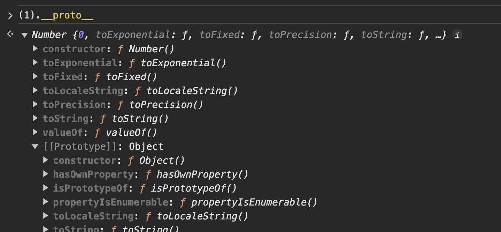
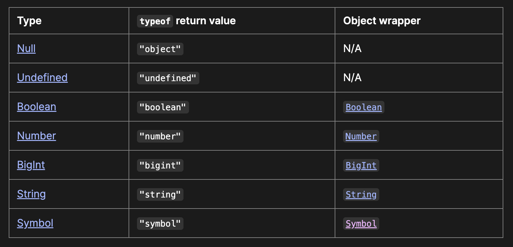

# JavaScript 類型判斷 Best Practice

## JavaScript 類型

JavaScript 的資料型別可分為 `6` 種 `Primitive Type` 跟一個 `Object`

-   Primitive Type
    -   `null`
    -   `undefined`
    -   `Boolean`
    -   `Number`
    -   `BigInt`
    -   `String`
    -   `Symbol`
-   Object

Function、Array 等等原型鏈底層其實都是 `Object`

Primitive Type 除了`null`跟`undefined`，其他外層都還會再包裝一個一層`Object wrapper`



如上圖，數字 1 的 prototype 的 prototype 是`Object`

就是像`String`、`Number`都會有一些`Method`可以使用

## typeof

### typeof primitive value

[MDN](https://developer.mozilla.org/en-US/docs/Web/JavaScript/Data_structures#primitive_values)有個 primitive value 用 typeof 回傳的值的表



除了`null`之外，其他的 primitive value 都如預期

`null`是 `Object`這個 bug，有它歷史的原因

詳情可以參考 `Dr. Axel Rauschmayer` 的[The history of “typeof null”](https://2ality.com/2013/10/typeof-null.html)這篇文章

他 blog 也有一篇有趣的文章叫[JavaScript history: undefined](https://2ality.com/2013/05/history-undefined.html)

他有寫了幾本的 Javascript 書籍，可以線上免費閱讀

-   [JavaScript for impatient programmers](https://exploringjs.com/impatient-js/)
-   [Deep JavaScript: Theory and techniques](https://exploringjs.com/deep-js/)
-   [Tackling TypeScript: Upgrading from JavaScript](https://exploringjs.com/tackling-ts/)
-   [Shell scripting with Node.js ](https://exploringjs.com/nodejs-shell-scripting/)

### typeof object

其他非 primitive 用 typeof 回傳的值，不是`function`就是`object`

沒辦法知道更細粒度的判斷`Array`、`Error`、`Date`之類的

## lodash 跟 vue.js 的判斷方式

[lodash](https://github.dev/lodash/lodash/blob/c7c70a7da5172111b99bb45e45532ed034d7b5b9/src/.internal/getTag.ts)跟 [vue.js](https://github.dev/vuejs/core/blob/7bedaef4b15d0a402fda5aa0cf9185b5a3d7f98e/packages/shared/src/general.ts)都是利用 `Object prototype` 的 `toString` 方法來判斷

寫法大致如下

```js
const toTypeString = (value) => Object.prototype.toString.call(value)
// value強制使用 Object 的 toString 方法

const isRegExp = (val) => toTypeString(val) === '[object RegExp]'
const isDate = (val) => toTypeString(val) === '[object Date]'
const isError = (val) => toTypeString(val) === '[object Error]'
const isSet = (val) => toTypeString(val) === '[object Set]'
const isMap = (val) => toTypeString(val) === '[object Map]'
const isWeakMap = (val) => toTypeString(val) === '[object WeakMap]'
const isWeakSet = (val) => toTypeString(val) === '[object WeakSet]'
```

vue.js 他有些類型判斷的還是用 typeof

雖然 Object toString 的方式可以通吃

<Comment />
