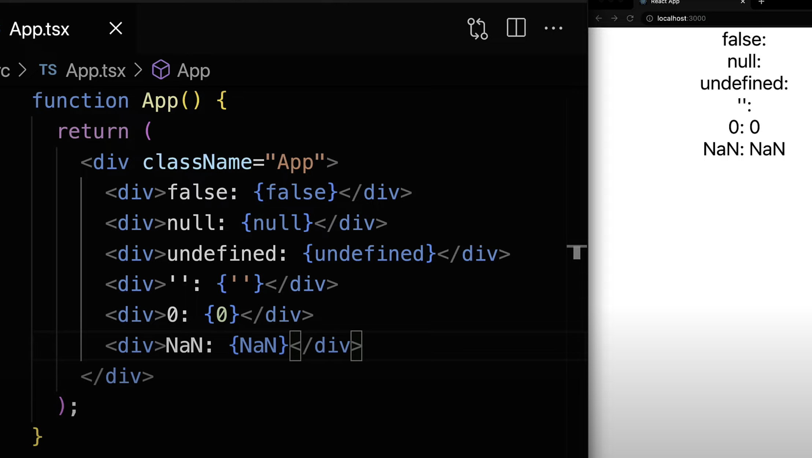

# React 條件渲染的最佳實踐

## 前言

`React`的`條件渲染`寫得好不好，代碼的`易讀性`真的差非常多，React 很靈活，但是相對的，也很容易寫出很糟糕的代碼，天花板很高，但是樓地板也很低，尤其是維護一些 legacy code，有時都看到想捶桌子。`Vue`因為用了`模板`，某種程度也墊高了樓地板的高度。

## falsy value

Javascript 中的 `falsy value` 有六種：

-   false
-   undefined
-   null
-   ''
-   0
-   NaN

### React 中的 falsy value

falsy value 在 React 中的行為，廢話不多說，直接上代碼。



可以看到，除了`0`跟`NaN`，其他 4 種都不會被渲染出來，這很重要，尤其是`0`，很常遇到，而且會衍生另外一個問題．

### 0 的問題

Javascript 的`邏輯運算符`(`Logical Operators`)，共有三種：

-   &&
-   ||
-   !

PS：假有只有一個`&`或是`|`，他就變成`位元邏輯運算符`(`Bitwise operators`)，一般後端有時會拿來設計`權限`，或是多個`狀態`，很方便，運算很快，但是相對不好懂。

在寫條件渲染的時候，很常拿`&&`來使用，使用方法如下圖。

-   當`&&`左邊是`truthy`的時候，顯示`右邊`
-   當`&&`左邊是`falsy`的時候，顯示`左邊`

```js
const isLogin = true
console.log(isLogin && '已登入') // 已登入

const isEditing = false
console.log(isEditing && '編輯中') // false
```

但是有個場景，判斷某個 Array 的長度，然後顯示 List。

因為 lengh 為`0`(`falsy`)時，他會顯示`&&`的左邊`0`，而剛好 React 會把`0`顯示出來，通常這結果不是我們要的。

```js
export function App(props) {
    const arr = []
    function List() {
        return arr.map((item, index) => <div key={index}>{item}</div>)
    }

    return <div className="App">{arr.length && <List />}</div> //畫面顯示0
}
```

### 0 問題的解法

問題解法有三種：

-   用`條件三元運算`(`ternary`)的寫法
-   用`!!`兩次取反，所得結果會把原本的`truthy`/`falsy`轉成`true`/`false`
-   直接就寫 arr.length > 0

#### 條件三元運算

當`arr.length`為`0`(`falsy`)的時候，回傳`null`，`null`在 React 中不會顯示出來

```jsx
export function App(props) {
    const arr = []
    function List() {
        return arr.map((item, index) => <div key={index}>{item}</div>)
    }

    return <div className="App">{arr.length ? <List /> : null}</div> //畫面空白
}
```

#### !!兩次取反

`!!`兩次取反，負負得正，原本`falsy`就會變成`false`，`false`不會被 React 顯示出來

```jsx
export function App(props) {
    const arr = []
    function List() {
        return arr.map((item, index) => <div key={index}>{item}</div>)
    }

    return <div className="App">{!!arr.length && <List />}</div> //畫面空白
}
```

兩次取反會比較好用，因為在 Javascript 中使用`:`還蠻多的，而且`:`挺容易被忽略或是沒看到，兩次取反也算是 javacript 的 trick。

## React 條件渲染的正確姿勢

做了一些研究，[官方文件](https://react.dev/learn/conditional-rendering)也有一篇專門在講 conditional render，但是我覺得[LogRocket 這篇](https://blog.logrocket.com/react-conditional-rendering-9-methods/)最完整

我覺得比較好用的方式如下，沒那麼好用的就不提了，有興趣的自己點進去看文章

-   sub component
-   enum object
-   精簡版的&&或是三元

### sub component

文中示範了如以下的寫法：

```jsx
const If = (props) => {
    const condition = props.condition || false
    const positive = props.then || null
    const negative = props.else || null

    return condition ? positive : negative
}

const app = () => {
    const view = this.state.mode === 'view'
    const editComponent = <EditComponent handleEdit={this.handleEdit} />
    const saveComponent = <SaveComponent handleChange={this.handleChange} />

    return (
        <div>
            <p>Text: {this.state.text}</p>
            <If condition={view} then={editComponent} else={saveComponent} />
        </div>
    )
}
```

有提到了另外一個套件：[jsx-control-statements](https://github.com/AlexGilleran/jsx-control-statements)，`jsx-control-statements`的樣子我更喜歡

```jsx
<If condition={true}>
    <span>IfBlock</span>
</If>
```

他沒有 else，不過也很好解，就是把 condition 加`!`取反就好了

比較喜歡這種`邏輯判斷`的跟要`顯示view`的分開來，很清楚，他有一些類似 switch case 的之類的判斷，但是我沒有很喜歡，而且可以寫成 enum object 的方式

可以自己封裝 If component 來使用

```jsx
export default function App() {
    return (
        <div>
            <If condition={false}>
                <div className="App">Hello World</div>
            </If>
        </div>
    )
}

function If({ children, condition }) {
    return condition && children
}
```

### enum object

他文中的案例如下

```jsx
const Components = Object.freeze({
  view: <EditComponent handleEdit={this.handleEdit} />,
  edit: <SaveComponent
          handleChange={this.handleChange}
          handleSave={this.handleSave}
          text={this.state.inputText}
        />
});

...
const key = this.state.mode;
return (
  <div>
    { Components[key] }
  </div>
);
```

我寫的話，會更進階封裝如下

```jsx
const A = ({ text }) => <div>我是A,{text}</div>
const B = ({ text }) => <div>我是B,{text}</div>
export default function App({ type }) {
    const options = {
        A: {
            ContentComponent: A,
            attr: { text: 'hello A' }
        },
        B: {
            ContentComponent: B,
            attr: { text: 'hello B' }
        }
    }
    const { ContentComponent, attr } = options[type]

    return (
        <div>
            <ContentComponent {...attr} />
        </div>
    )
}
```

這樣寫可以根據不同的`type`，顯示對應的 `component`，還可以有對應的 `attribute`，非常好用，代碼又乾淨。

有一點值得提的就是，假如要在 return 裡面寫成`<ContentComponent {...attr}/>`的形式，那 ContentComponent 對應的值只能是`function`或是`string`

options.A.ContentComponent = `<A />`，這時`<A />`已經被轉成 `Object` 了，會報錯。

### 精簡版的&&或是三元

為何強調是`精簡版`，因為假如沒把 jsx 抽出來，寫在三元的()裡面，邏輯一多，完全就是災難，直接看代碼。

```jsx
export default function App() {
    const isLogin = false
    const isEditing = true

    return (
        <div>
            {isLogin ? <A text="hello A" /> : <B text="hello B" />}
            {isEditing && <B text="hello B" />}
        </div>
    )
}

function A({ text }) {
    return <div>我是A,{text}</div>
}
function B({ text }) {
    return <div>我是B,{text}</div>
}
```

用邏輯運算符`&&`或是`三元運算符`，假如後面是只有接 component，那代碼依舊是非常的乾淨清楚，甚至好的 component`命名`，會讓人一眼就知道他是什麼東西，就跟好的`變數命名`一樣，代碼本身就是`註解`，變數命名本身也像是`註解`，那是寫`clean code`非常有用的技巧。

像上面的 component A 跟 B，透過 `hoisting`，用 function 宣告，把它寫在主要內容的下面，有點類似`備註`的感覺。

代碼由上往下看，一下子就看到`主要內容`，了解裡面有什麼，想要看 component A 有什麼內容，往下拉去查看，尤其是這些 component 並沒有被其他 component 共用，就不用在額外抽出到另外一個檔案裡面

<Comment />
