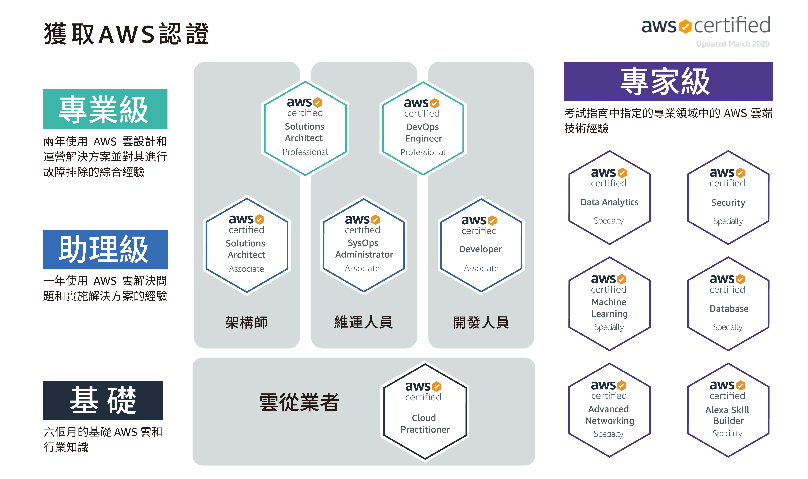

# CNCF 跟 AWS 證照

## 新證照

2023 年 linux fundation 多了三個新證照

-   [ICA](https://www.cncf.io/blog/2023/09/21/new-certification-istio-certified-associate-ica/) (istio)
-   [CAPA](https://www.cncf.io/blog/2023/11/06/coming-soon-certified-argo-project-associate/) (argocd)
-   [PCA](https://www.cncf.io/training/certification/pca/) (prometheus)

2024 年 2 月又多了一個證照

-   [CGOA](https://www.cncf.io/blog/2024/02/21/launching-the-new-gitops-associate-certification-cgoa/)(gitops)

出了證照，某種程度也代表了`官方的態度`，蠻重要的參考指標

## CKA 特價

記得從 2023 年開始，CKA 之類的考照費用，從`299美`變成`399美`，這個漲價還是挺有感的

這一次二月份的特價，bundle 原本就有稍微便宜，還直接 bundle `50%off`

看一下組合還有 CKA、CKAD、CKS 考證的 bundle，`549.5 美元`

以原價來看，549.5/1197 = 0.459

將近 `54%off`，好誘人

今年太忙了，明年再戰

印象中最便宜大概就這樣了

做個紀錄

## AWS 證照

AWS 證照等級分三種

-   `Practitioner`
-   `Associate`
-   `Professional`

AWS 考證過了，都會給`50%折價券`去考下一個證照

所以有沒有連續考過還是挺重要的，省錢

做個筆記

<Comment />
