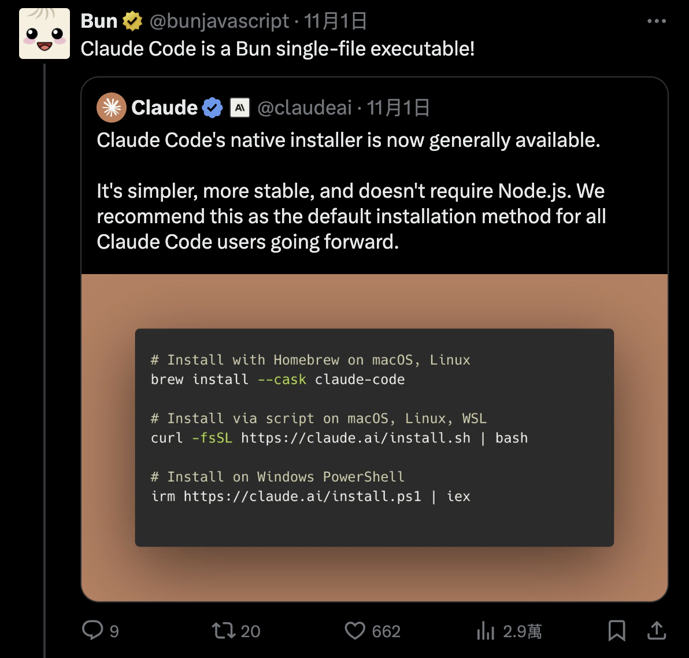

## 前言

claude code出了單執行檔的`原生`安裝方式，這篇主要不是單純講安裝的方式，是挖深下去發現的有趣東西，記錄一下

## 安裝方式

```sh
# Homebrew (macOS, Linux):
brew install --cask claude-code

# macOS, Linux, WSL:
curl -fsSL https://claude.ai/install.sh | bash

```

### Homebrew

cask有`桶`、`成品`的意思，這邊就是原本是尋找跟執行command line的執行檔，加了`--cask`參數，他就知道要安裝的是`.dmg` 或`.pkg` 的軟體。

詳細的資訊其實是對應這個[ruby檔案](https://github.com/Homebrew/homebrew-cask/blob/8b4bd317b773eab10552c55de2a0feaff4f97ad2/Casks/c/claude-code.rb)

下載的檔案路徑就是這個，https://storage.googleapis.com/claude-code-dist-86c565f3-f756-42ad-8dfa-d59b1c096819/claude-code-releases/#{version}/#{os}-#{arch}/claude

`version`、`os`、`arch`代碼前面都有定義

然後這個單一執行檔，其實是用`bun`去compile的，bun官方也有發一張圖，還是JS的範疇



現在主流compile成單一執行檔的，有`deno`跟`bun`兩個solution，對應的技術棧分別是
- `deno`：`Rust` + `v8`
- `bun`：`Zig` + `javascript core`

透過AI再挖深一點，知道v8功能比較多，但相對肥大一點，Rust跟Zig(現代版的C)其實差不多，compile出來，deno版的會大個10~20mb．

我記得react native的JS引擎是用`javascript core`，不是`V8`，好奇再追下去，原來是因為IOS對`javascript core`的原生支持。

說真的，AI現在影響最大的找資料跟學習，以前要釐清這些關係，都不知道要多花多少力氣。


### bash installation

```sh
curl -fsSL https://claude.ai/install.sh | bash
```

這段意思就是用`curl`的指令去下載該網址的某個`script`腳本，然後用`bash`去執行它。`|`是`pipe`，就是`|`把左邊的結果丟給右邊的去執行，`-fsSL`的參數意思，分別代表
- f:`fail silent`，失敗時不輸出錯誤頁面，只回傳錯誤碼。
- s:`silent`，靜默模式，不顯示進度或錯誤訊息。
- S:`show error`，簡潔模式下，如果出錯則顯示錯誤訊息。
- L:`follow redirect`，跟蹤重定向，假如請求的 URL 被重定向，curl 會跟著重定向 URL 下載。


install.sh代碼如下
```sh
#!/bin/bash

set -e

# Parse command line arguments
TARGET="$1"  # Optional target parameter

# Validate target if provided
if [[ -n "$TARGET" ]] && [[ ! "$TARGET" =~ ^(stable|latest|[0-9]+\.[0-9]+\.[0-9]+(-[^[:space:]]+)?)$ ]]; then
    echo "Usage: $0 [stable|latest|VERSION]" >&2
    exit 1
fi

GCS_BUCKET="https://storage.googleapis.com/claude-code-dist-86c565f3-f756-42ad-8dfa-d59b1c096819/claude-code-releases"
DOWNLOAD_DIR="$HOME/.claude/downloads"

# Check for required dependencies
DOWNLOADER=""
if command -v curl >/dev/null 2>&1; then
    DOWNLOADER="curl"
elif command -v wget >/dev/null 2>&1; then
    DOWNLOADER="wget"
else
    echo "Either curl or wget is required but neither is installed" >&2
    exit 1
fi

# Check if jq is available (optional)
HAS_JQ=false
if command -v jq >/dev/null 2>&1; then
    HAS_JQ=true
fi

# Download function that works with both curl and wget
download_file() {
    local url="$1"
    local output="$2"
    
    if [ "$DOWNLOADER" = "curl" ]; then
        if [ -n "$output" ]; then
            curl -fsSL -o "$output" "$url"
        else
            curl -fsSL "$url"
        fi
    elif [ "$DOWNLOADER" = "wget" ]; then
        if [ -n "$output" ]; then
            wget -q -O "$output" "$url"
        else
            wget -q -O - "$url"
        fi
    else
        return 1
    fi
}

# Simple JSON parser for extracting checksum when jq is not available
get_checksum_from_manifest() {
    local json="$1"
    local platform="$2"
    
    # Normalize JSON to single line and extract checksum
    json=$(echo "$json" | tr -d '\n\r\t' | sed 's/ \+/ /g')
    
    # Extract checksum for platform using bash regex
    if [[ $json =~ \"$platform\"[^}]*\"checksum\"[[:space:]]*:[[:space:]]*\"([a-f0-9]{64})\" ]]; then
        echo "${BASH_REMATCH[1]}"
        return 0
    fi
    
    return 1
}

# Detect platform
case "$(uname -s)" in
    Darwin) os="darwin" ;;
    Linux) os="linux" ;;
    *) echo "Windows is not supported" >&2; exit 1 ;;
esac

case "$(uname -m)" in
    x86_64|amd64) arch="x64" ;;
    arm64|aarch64) arch="arm64" ;;
    *) echo "Unsupported architecture: $(uname -m)" >&2; exit 1 ;;
esac

# Check for musl on Linux and adjust platform accordingly
if [ "$os" = "linux" ]; then
    if [ -f /lib/libc.musl-x86_64.so.1 ] || [ -f /lib/libc.musl-aarch64.so.1 ] || ldd /bin/ls 2>&1 | grep -q musl; then
        platform="linux-${arch}-musl"
    else
        platform="linux-${arch}"
    fi
else
    platform="${os}-${arch}"
fi
mkdir -p "$DOWNLOAD_DIR"

# Always download stable version (which has the most up-to-date installer)
version=$(download_file "$GCS_BUCKET/stable")

# Download manifest and extract checksum
manifest_json=$(download_file "$GCS_BUCKET/$version/manifest.json")

# Use jq if available, otherwise fall back to pure bash parsing
if [ "$HAS_JQ" = true ]; then
    checksum=$(echo "$manifest_json" | jq -r ".platforms[\"$platform\"].checksum // empty")
else
    checksum=$(get_checksum_from_manifest "$manifest_json" "$platform")
fi

# Validate checksum format (SHA256 = 64 hex characters)
if [ -z "$checksum" ] || [[ ! "$checksum" =~ ^[a-f0-9]{64}$ ]]; then
    echo "Platform $platform not found in manifest" >&2
    exit 1
fi

# Download and verify
binary_path="$DOWNLOAD_DIR/claude-$version-$platform"
if ! download_file "$GCS_BUCKET/$version/$platform/claude" "$binary_path"; then
    echo "Download failed" >&2
    rm -f "$binary_path"
    exit 1
fi

# Pick the right checksum tool
if [ "$os" = "darwin" ]; then
    actual=$(shasum -a 256 "$binary_path" | cut -d' ' -f1)
else
    actual=$(sha256sum "$binary_path" | cut -d' ' -f1)
fi

if [ "$actual" != "$checksum" ]; then
    echo "Checksum verification failed" >&2
    rm -f "$binary_path"
    exit 1
fi

chmod +x "$binary_path"

# Run claude install to set up launcher and shell integration
echo "Setting up Claude Code..."
"$binary_path" install ${TARGET:+"$TARGET"}

# Clean up downloaded file
rm -f "$binary_path"

echo ""
echo "�� Installation complete!"
echo ""

```

簡單講一下流程就是
- 先檢查curl跟wget，主要下載檔案的方式
- 後檢查jq，為了解析json，原生的bash也可以處理，但是會有發生錯誤的機率，並提高維護成本
- 宣告GCS_BUCKET、DOWNLOAD_DIR等變數，有些拿來組路徑字串等等功能用
- 宣告download_file函數，下載檔案用，使用curl或是wget
- 宣告get_checksum_from_manifest，主要是用來比對下載的檔案是否正確，是否被竄改。
- 透過download_file，把檔案下載到$binary_path
- 然後再用install去安裝與環境設置相關的任務，如建立啟動器、整合 shell 環境、配置路徑與設定

TLDR就是下載，比對驗證，安裝。


<Comment />