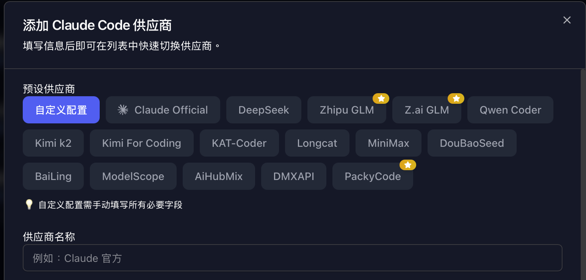

## 前言     

`codex`跟`claude code`是現在兩個最強的`Terminal-Integrated AI Coding Assistant`，光看CLI的功能，
claude code是遙遙領先的，但是缺點就是比較貴，這篇教怎麼在使用claude code這個工具，但是接其他的LLM


## 原理

要接不同的LLM，主要就設定兩個環境變量：`ANTHROPIC_BASE_URL`跟`ANTHROPIC_API_KEY`(設定`ANTHROPIC_AUTH_TOKEN`也可以)，去設定API的Endpoint跟打API認證時所需要的token。

吃的設定檔先後順序如下：
- `.claude/settings.local.json` (project級別,不進版控)
  - 有.local表示本機用的，沒有共享，這是一個約定俗成 (convention over configuration) 設定
- `.claude/settings.json` (project級別,會進版控)
- `~/.claude/settings.json` (user級別)
- `環境變數`


### 環境變數

TLDR 
設定`~/.zshrc` 


這邊能設定的點有點多，linux跟mac還有點不一樣，而且shell種類也會影響，不過以`mac`來看，就是直接設定`~/.zshrc`就好了，下面做點紀錄

設定主要分三塊，會有先後載入的順序:
- login shell (OS系統級)
- non-login shell (OS系統級)
- 根據shell種類的設定

`linux bash版本`
```bash
# 1. 系統全域設定
/etc/profile
    ↓ (內部會載入)
/etc/profile.d/*.sh

# 2. 使用者個人設定（只載入第一個找到的）
~/.bash_profile  # 優先
    ↓ (若不存在)
~/.bash_login    # 次要
    ↓ (若不存在)
~/.profile       # 最後

# 3. 通常 ~/.bash_profile 內部會載入
~/.bashrc
    ↓ (內部會載入)
/etc/bashrc (或 /etc/bash.bashrc)
```

`mac zsh版本`
```bash
步驟 1: 任何模式都載入
~/.zshenv

步驟 2: 系統全域 Login 設定
/etc/zprofile

步驟 3: 使用者 Login 設定
~/.zprofile

步驟 4: 系統全域互動式設定
/etc/zshrc

步驟 5: 使用者互動式設定
~/.zshrc

步驟 6: 系統 Login 後執行
/etc/zlogin

步驟 7: 使用者 Login 後執行
~/.zlogin

```

## 環境變數的設定格式

### 在settings.json設定

```json
{
  ....,
  "env": {
    "ANTHROPIC_API_KEY": "...",
    "ANTHROPIC_BASE_URL": "..."
  }
}

```

### 在環境變數設定

`直接設定環境變量`
```bash
export ANTHROPIC_API_KEY="...."
export ANTHROPIC_BASE_URL="...."
```

`執行指令時，去注入環境變量`
```bash
alias glm-cc='ANTHROPIC_API_KEY="..." ANTHROPIC_BASE_URL="..." claude --dangerously-skip-permissions'
```

`用function的方式，比較好閱讀，$1表示第一個傳入的參數`
```bash
kimi() {
  export ANTHROPIC_BASE_URL=https://api.moonshot.cn/anthropic
  export ANTHROPIC_API_KEY={{kimi_api_key}}
  claude $1
}
alias kimi_yolo='kimi --dangerously-skip-permissions'
```


## 用CC-Switch設定

先講個概念，LLM API的格式主要分三種:
- `OpenAI`
- `Anthropic`
- `google`

大部分LLM會是用OpenAI的格式，但是有些會有很小的部分不一樣（去看[claude code router源碼](https://github.com/musistudio/claude-code-router)知道的），大多數都以OpenAI的為標準。

Anthropic因為他們的`claude code`太強了太好用了，所以大陸那些一線的LLM除了支援`OpenAI`的格式外，還額外另個支援`claude code`的格式


而[CC-Switch](https://github.com/farion1231/cc-switch)是社群開發的一個切換claude code LLM的工具，其實有好幾個，但是這個最成熟，最多github星星

除了設定好之後，可以快速切換之外，他有一個很好的優點就是，他會把市面上支援`claude code格式`的LLM都列出來，你就會知道要去搜哪些關鍵字，當你對生態並不是那麼熟悉的時候



大部分都是中國一線的model，或者是有提供那些model的中盤商，中國一線的model performancer都很接近歐美一線大廠，重點是`價格`通常只有claude的`1/6`，提供的`token用量`是claude的`3倍`以上，便宜又大碗

`DeepSeek`、`GLM`、`Kimi`、`Kat-Coder`、`MiniMax`這幾個都在twitter被熱烈討論過。

我是推薦`GLM`，除了效果好之外，他們的Pro方案，還提供好用的mcp，有：
- [Vision MCP Server](https://docs.z.ai/devpack/mcp/vision-mcp-server)
  - 解析`圖片`甚至是`影片`（claude code原生的不支援解析影片）
- [Web Search MCP Server](https://docs.z.ai/devpack/mcp/search-mcp-server)
  - `搜尋`網頁資訊，回傳結果包括頁面標題、網址、摘要、網站名稱、網站圖示等，主要是`內容摘要`。
- [Web Reader MCP Server](https://docs.z.ai/devpack/mcp/search-mcp-server)
  - `Reader`會把該網頁網頁內容`結構化`，並包含`細節`


最新的v3.7版，還可以編輯`system prompt`、`mcp`跟`skill`


<Comment />